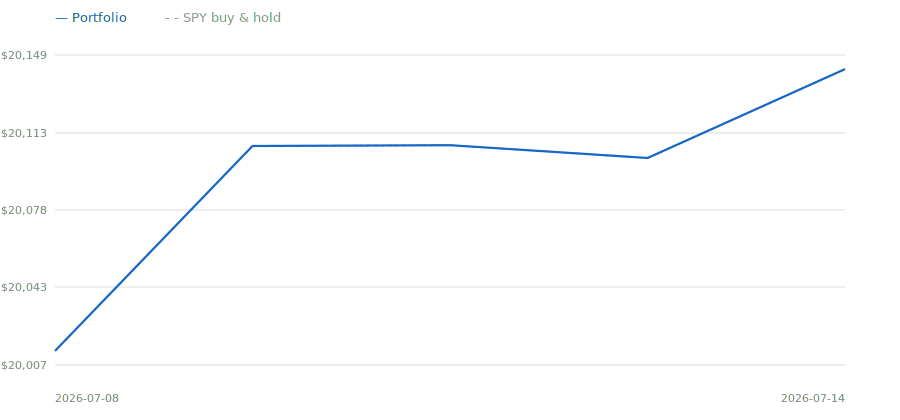

# Paper Trading Account — Performance Report

**➜ [Interactive dashboard](https://jasper-bolante.github.io/paper-trader/)** — hover/click any term to learn what it means, toggle the chart lines, and browse full trade history.

_Updated 2026-07-17 14:59 UTC · inception 2026-07-08 · drawdown state: **normal**_

## Account

| | |
|---|---:|
| **Equity (net of tax reserve)** | **$19,808.82** |
| Total return since inception | -0.96% |
| S&P 500 benchmark (same $ , dividends reinvested) | $20,209.12 (1.05%) |
| Positions value | $18,311.17 |
| Settled cash | $1,486.06 |
| Unsettled cash (T+1) | $17.25 |
| Tax reserve | $5.67 |

## Risk-adjusted metrics

| Metric | Portfolio | Benchmark |
|---|---:|---:|
| Total return | -0.87% | 0.87% |
| Annualized volatility | 8.74% | 10.38% |
| Sharpe (rf 4%) | -4.62 | 3.16 |
| Max drawdown | 1.50% | 0.77% |
| EOD observations | 7 | 7 |

## Positions

| Symbol | Qty | Avg basis | Last | Value | Unrealized | Stop |
|---|---:|---:|---:|---:|---:|---:|
| BEN | 42 | $33.14 | $32.66 | $1,371.72 | $-20.24 | $30.26 |
| CNC | 13 | $66.94 | $64.58 | $839.48 | $-30.76 | $61.84 |
| DDOG | 3 | $260.67 | $256.81 | $770.43 | $-11.57 | $236.06 |
| DVA | 6 | $227.39 | $236.14 | $1,416.84 | $52.48 | $211.95 |
| FFIV | 3 | $430.59 | $408.06 | $1,224.18 | $-67.59 | $388.22 |
| FTNT | 5 | $155.14 | $161.62 | $808.10 | $32.42 | $150.16 |
| HUM | 2 | $401.64 | $393.84 | $787.68 | $-15.60 | $366.83 |
| IBKR | 10 | $95.61 | $90.31 | $903.10 | $-52.96 | $87.64 |
| MPC | 3 | $306.56 | $309.63 | $928.89 | $9.21 | $275.76 |
| NTAP | 5 | $161.48 | $161.45 | $807.25 | $-0.13 | $145.92 |
| SPY | 5 | $743.10 | $745.00 | $3,725.00 | $9.50 | — |
| STT | 8 | $185.86 | $183.13 | $1,465.04 | $-21.83 | $168.04 |
| UNH | 3 | $425.21 | $426.40 | $1,279.21 | $3.60 | $382.79 |
| URI | 1 | $1,090.35 | $1,070.58 | $1,070.58 | $-19.77 | $980.79 |
| VLO | 3 | $304.72 | $304.56 | $913.68 | $-0.48 | $274.10 |

## Realized gains & tax

| Year | ST net (allowed) | LT net (allowed) | Wash-disallowed | 
|---|---:|---:|---:|
| 2026 | $-89.61 | $0.00 | $0.00 |

Dividends received: $37.83. Assumed rates: 24% short-term, 15% long-term, 15% dividends, no state tax.

## Recent decisions

- `2026-07-17T14:59` entry buy **VLO** — momentum entry: rank 9, mom 0.376, vol 40%
- `2026-07-17T14:59` no_trade skip_entry **DAL** — insufficient investable cash (size $435, need >= $500)
- `2026-07-17T14:59` no_trade skip_entry **MGM** — insufficient investable cash (size $435, need >= $500)
- `2026-07-17T14:59` no_trade skip_entry **MNST** — insufficient investable cash (size $435, need >= $500)
- `2026-07-17T14:59` no_trade skip_entry **CVS** — insufficient investable cash (size $435, need >= $500)
- `2026-07-17T14:59` no_trade skip_entry **DOC** — insufficient investable cash (size $435, need >= $500)
- `2026-07-17T14:59` no_trade skip_entry **WST** — insufficient investable cash (size $435, need >= $500)
- `2026-07-17T14:59` no_trade skip_entry **JBHT** — insufficient investable cash (size $435, need >= $500)
- `2026-07-17T14:59` no_trade skip_entry **TRGP** — insufficient investable cash (size $435, need >= $500)
- `2026-07-16T20:29` system — eod_complete
- `2026-07-16T18:43` no_trade — no signals crossed action thresholds this hour
- `2026-07-16T18:43` no_trade skip_entry — no entry slots (positions 13/15, new today 2/2)
- `2026-07-16T16:50` no_trade — no signals crossed action thresholds this hour
- `2026-07-16T16:50` no_trade skip_entry — no entry slots (positions 13/15, new today 2/2)
- `2026-07-16T15:18` entry buy **MPC** — momentum entry: rank 9, mom 0.374, vol 34%

_Full decision log: `state/decisions.jsonl` · full history: `state/trader.db`_
