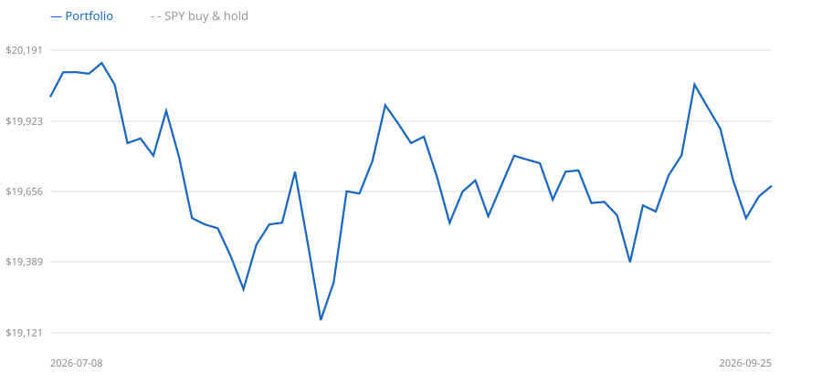

# Paper Trading Account — Performance Report

**➜ [Interactive dashboard](https://jasper-bolante.github.io/paper-trader/)** — hover/click any term to learn what it means, toggle the chart lines, and browse full trade history.

_Updated 2026-07-29 18:33 UTC · inception 2026-07-08 · drawdown state: **normal**_

## Account

| | |
|---|---:|
| **Equity (net of tax reserve)** | **$19,313.07** |
| Total return since inception | -3.43% |
| S&P 500 benchmark (same $ , dividends reinvested) | $19,937.96 (-0.31%) |
| Positions value | $16,027.09 |
| Settled cash | $1,668.58 |
| Unsettled cash (T+1) | $1,623.56 |
| Tax reserve | $6.16 |

## Risk-adjusted metrics

| Metric | Portfolio | Benchmark |
|---|---:|---:|
| Total return | -3.01% | -0.49% |
| Annualized volatility | 9.09% | 10.53% |
| Sharpe (rf 4%) | -6.43 | -1.16 |
| Max drawdown | 3.62% | 2.21% |
| EOD observations | 15 | 15 |

## Positions

| Symbol | Qty | Avg basis | Last | Value | Unrealized | Stop |
|---|---:|---:|---:|---:|---:|---:|
| DDOG | 3 | $260.67 | $270.15 | $810.46 | $28.46 | $236.93 |
| DOC | 32 | $22.25 | $22.55 | $721.60 | $9.58 | $20.55 |
| DVA | 6 | $227.39 | $240.09 | $1,440.57 | $76.21 | $215.55 |
| FTNT | 7 | $149.43 | $146.77 | $1,027.39 | $-18.65 | $131.17 |
| HUM | 3 | $391.16 | $357.64 | $1,072.92 | $-100.55 | $329.83 |
| JBHT | 3 | $277.72 | $274.58 | $823.74 | $-9.43 | $252.76 |
| MPC | 3 | $306.56 | $309.48 | $928.44 | $8.76 | $287.83 |
| NTAP | 5 | $161.48 | $175.59 | $877.95 | $70.57 | $157.11 |
| PSX | 5 | $215.50 | $208.26 | $1,041.30 | $-36.18 | $191.32 |
| SPY | 5 | $743.10 | $736.86 | $3,684.30 | $-31.20 | — |
| STT | 8 | $185.86 | $177.66 | $1,421.28 | $-65.59 | $168.04 |
| UNH | 3 | $425.21 | $421.61 | $1,264.83 | $-10.79 | $393.25 |
| VLO | 3 | $304.72 | $304.10 | $912.30 | $-1.86 | $283.28 |

## Realized gains & tax

| Year | ST net (allowed) | LT net (allowed) | Wash-disallowed | 
|---|---:|---:|---:|
| 2026 | $-641.19 | $0.00 | $95.51 |

Dividends received: $41.08. Assumed rates: 24% short-term, 15% long-term, 15% dividends, no state tax.

## Recent decisions

- `2026-07-29T18:33` no_trade — no signals crossed action thresholds this hour
- `2026-07-29T18:33` no_trade skip_entry — no entry slots (positions 12/15, new today 2/2)
- `2026-07-29T16:52` no_trade — no signals crossed action thresholds this hour
- `2026-07-29T16:52` no_trade skip_entry — no entry slots (positions 12/15, new today 2/2)
- `2026-07-29T15:32` entry buy **HUM** — momentum entry: rank 4, mom 0.701, vol 33%
- `2026-07-29T15:32` entry buy **FTNT** — momentum entry: rank 2, mom 1.006, vol 35%
- `2026-07-29T15:31` exit sell **IBKR** — trailing stop 10%
- `2026-07-29T15:31` exit sell **HUM** — trailing stop 10%
- `2026-07-28T20:03` system — eod_complete
- `2026-07-28T17:58` no_trade — no signals crossed action thresholds this hour
- `2026-07-28T17:58` no_trade skip_entry **CSX** — insufficient investable cash (size $16, need >= $500)
- `2026-07-28T17:58` no_trade skip_entry **BBY** — insufficient investable cash (size $16, need >= $500)
- `2026-07-28T17:58` no_trade skip_entry **ADM** — insufficient investable cash (size $16, need >= $500)
- `2026-07-28T17:58` no_trade skip_entry **TRV** — insufficient investable cash (size $16, need >= $500)
- `2026-07-28T17:58` no_trade skip_entry **CVS** — insufficient investable cash (size $16, need >= $500)

_Full decision log: `state/decisions.jsonl` · full history: `state/trader.db`_
