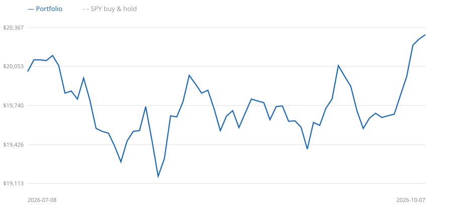

# Paper Trading Account — Performance Report

**➜ [Interactive dashboard](https://jasper-bolante.github.io/paper-trader/)** — hover/click any term to learn what it means, toggle the chart lines, and browse full trade history.

_Updated 2026-09-28 20:12 UTC · inception 2026-07-08 · drawdown state: **normal**_

## Account

| | |
|---|---:|
| **Equity (net of tax reserve)** | **$19,643.07** |
| Total return since inception | -1.78% |
| S&P 500 benchmark (same $ , dividends reinvested) | $20,603.96 (3.02%) |
| Positions value | $18,298.50 |
| Settled cash | $1,333.14 |
| Unsettled cash (T+1) | $25.90 |
| Tax reserve | $14.47 |

## Risk-adjusted metrics

| Metric | Portfolio | Benchmark |
|---|---:|---:|
| Total return | -1.85% | 2.84% |
| Annualized volatility | 11.15% | 11.62% |
| Sharpe (rf 4%) | -1.05 | 0.78 |
| Max drawdown | 4.83% | 3.57% |
| EOD observations | 58 | 58 |

## Positions

| Symbol | Qty | Avg basis | Last | Value | Unrealized | Stop |
|---|---:|---:|---:|---:|---:|---:|
| ANET | 4 | $191.78 | $204.82 | $819.28 | $52.16 | $185.84 |
| APA | 19 | $44.15 | $42.34 | $804.37 | $-34.52 | $39.73 |
| BBY | 8 | $101.21 | $89.96 | $719.68 | $-90.00 | $85.36 |
| CRL | 3 | $296.67 | $294.55 | $883.65 | $-6.37 | $265.10 |
| FFIV | 2 | $448.44 | $435.28 | $870.56 | $-26.33 | $403.38 |
| IQV | 2 | $255.46 | $270.58 | $541.16 | $30.25 | $247.54 |
| MPC | 3 | $399.06 | $389.76 | $1,169.30 | $-27.88 | $358.97 |
| NTAP | 5 | $206.27 | $204.49 | $1,022.43 | $-8.92 | $184.04 |
| PSX | 5 | $215.50 | $253.51 | $1,267.55 | $190.07 | $246.58 |
| RVTY | 9 | $122.75 | $151.03 | $1,359.27 | $254.55 | $136.00 |
| SPY | 5 | $743.10 | $765.54 | $3,827.70 | $112.20 | — |
| TECH | 12 | $72.32 | $72.51 | $870.12 | $2.28 | $65.36 |
| TGT | 7 | $162.82 | $158.45 | $1,109.15 | $-30.56 | $147.91 |
| VLO | 3 | $392.61 | $389.11 | $1,167.33 | $-10.49 | $352.71 |
| WST | 2 | $370.69 | $375.85 | $751.70 | $10.32 | $338.27 |
| ZBRA | 3 | $345.13 | $371.75 | $1,115.26 | $79.88 | $334.58 |

## Realized gains & tax

| Year | ST net (allowed) | LT net (allowed) | Wash-disallowed | 
|---|---:|---:|---:|
| 2026 | $-935.56 | $0.00 | $1,142.35 |

Dividends received: $96.45. Assumed rates: 24% short-term, 15% long-term, 15% dividends, no state tax.

## Recent decisions

- `2026-09-25T21:46` system — eod_complete
- `2026-09-25T18:03` entry buy **WST** — momentum entry: rank 15, mom 0.333, vol 21%
- `2026-09-25T18:03` entry buy **FFIV** — momentum entry: rank 14, mom 0.335, vol 38%
- `2026-09-25T18:03` no_trade skip_entry **INCY** — sector cap: Health Care would exceed 25% of equity
- `2026-09-25T18:03` no_trade skip_entry **TMO** — sector cap: Health Care would exceed 25% of equity
- `2026-09-24T21:43` system — eod_complete
- `2026-09-24T17:55` entry buy **VLO** — momentum entry: rank 2, mom 0.681, vol 32%
- `2026-09-24T17:55` entry buy **MPC** — momentum entry: rank 1, mom 0.714, vol 30%
- `2026-09-23T21:42` system — eod_complete
- `2026-09-23T17:56` no_trade skip_entry **SOLV** — insufficient investable cash (size $37, need >= $500)
- `2026-09-23T17:56` no_trade skip_entry **EXPD** — insufficient investable cash (size $37, need >= $500)
- `2026-09-23T17:56` no_trade skip_entry **ADP** — insufficient investable cash (size $37, need >= $500)
- `2026-09-23T17:56` no_trade skip_entry **WAT** — insufficient investable cash (size $37, need >= $500)
- `2026-09-23T17:56` no_trade skip_entry **FFIV** — insufficient investable cash (size $37, need >= $500)
- `2026-09-23T17:56` no_trade skip_entry **TMO** — insufficient investable cash (size $37, need >= $500)

_Full decision log: `state/decisions.jsonl` · full history: `state/trader.db`_
